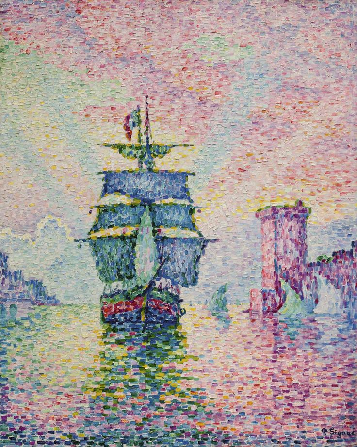
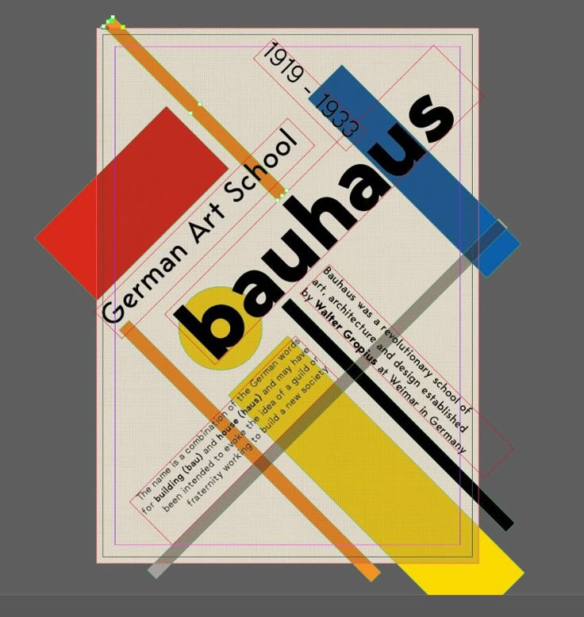
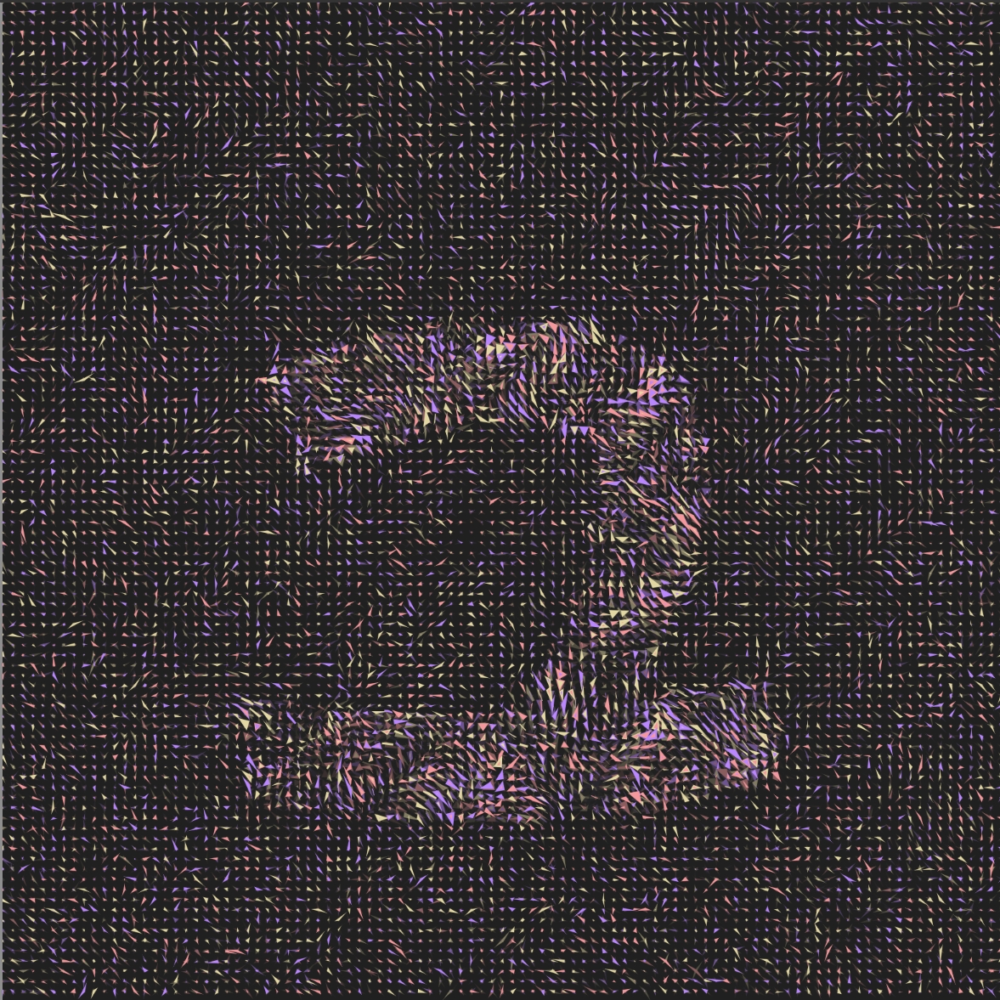

# lyan0475_9103_tut3_Quiz9
# 🎨 Quiz 8: Imaging & Coding Technique Exploration

## Part 1: Imaging Technique Inspiration – *Bauhaus Style*

For my assignment, I’m drawing inspiration from Bauhaus-style artwork, which uses geometric forms to express design principles while employing bold, vibrant colors for visual impact.
The first example (Fig 1)  demonstrates a Bauhaus poster composed of simple rectangles, circles, and triangles. These elements create distinct and overlapping spatial relationships, resulting in rich visual hierarchy. I plan to incorporate this clarity and structural approach into my layout to enhance readability and contemporary aesthetics.

Another key technique is asymmetrical balance (Fig 2) , where dynamic compositions maintain order while exuding energy. This aligns perfectly with my assignment’s need for clean, purposeful design. While replicating Bauhaus precision may be challenging, its foundational principles will guide my approach to form and function.

---

## Part 2: Coding Technique Exploration – *p5.js with Geometric Primitives*
To programmatically implement Bauhaus-style design, I've identified p5.js - a JavaScript library for creative coding - as an ideal tool. Its geometric primitives (such as rect() and line()) and minimalist color controls perfectly align with Bauhaus aesthetics.
For example, this p5.js sketch (Fig 3) demonstrates how basic shapes and a restricted color palette can create abstract compositions reminiscent of Bauhaus principles. The code example 🔗 [View Example Code](https://openprocessing.org/sketch/2149233) shows how simple geometric elements can be combined to produce visually striking results that maintain the movement's characteristic clarity and boldness.

