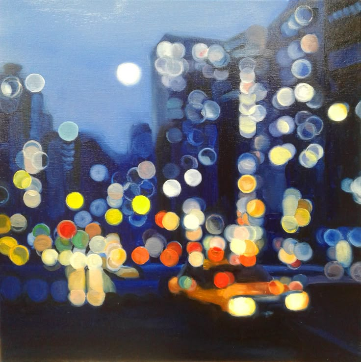

# lyan0475_9103_tut3_Quiz8
# 🎨 Quiz 8: Imaging & Coding Technique Exploration

## Part 1: Imaging Technique Inspiration – *Pointillism*
I am inspired by the Impressionist technique of pointillism—using dots of color to form imagery. I aim to recreate this hazy, fragmented beauty through color dots in my assignment. This method transforms scenes into abstract emotional expressions rather than clear visuals. The subtle blending of hues enhances the viewer's visual perception and evokes mood over detail. It aligns well with we goal of expressing atmosphere and emotional tone, immersive way, making it ideal for storytelling through visuals.

---

## Part 2: Coding Technique Exploration – *p5.js with Dynamic Points*
In order to achieve a more dynamic pointillism effect programmatically, I found a similar p5.js for this programming project. 🔗 [View Example Code](https://openprocessing.org/sketch/2149233) It creates a smart and hazy visual perception by adjusting the hue and dynamic offset in real time. This technique helps to make abstract artworks more alive.

